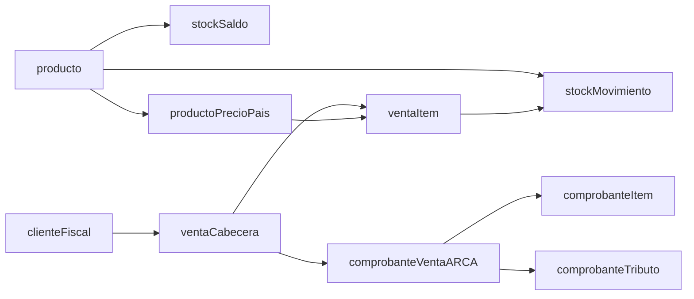

# Etapa 1: Stock sólido y base fiscal para ARCA

## Objetivo de esta etapa
Dejar el modelo de datos listo para: (1) controlar stock por `producto+talle` de forma transaccional y (2) preparar ventas/facturas con estructura compatible con ARCA (A/B/C), separando cabecera y detalle.

## Diagnóstico del estado actual
- Hoy `venta` está en formato agregado (cantidad/precio/total en la misma fila), sin detalle por ítem, lo que dificulta trazabilidad fiscal y de stock ([`/Users/santiago/Library/CloudStorage/OneDrive-Personal/me/Trabajo/Universal Jumps/Web Application/Universal Jumps/supabase/schema.sql`](/Users/santiago/Library/CloudStorage/OneDrive-Personal/me/Trabajo/Universal%20Jumps/Web%20Application/Universal%20Jumps/supabase/schema.sql)).
- `stockMovimiento` existe, pero no hay una capa de “existencia actual” ni reservas/descuentos atómicos para venta concurrente ([`/Users/santiago/Library/CloudStorage/OneDrive-Personal/me/Trabajo/Universal Jumps/Web Application/Universal Jumps/lib/stockService.js`](/Users/santiago/Library/CloudStorage/OneDrive-Personal/me/Trabajo/Universal%20Jumps/Web%20Application/Universal%20Jumps/lib/stockService.js)).
- `cliente` no tiene atributos fiscales suficientes para decidir A/B/C y validar emisión.

## Cómo deberían quedar las tablas (target)

### 1) Mantener y enriquecer catálogo
- **`producto`**: mantenerla como catálogo maestro; asegurar campos fiscales por defecto:
  - `codigo_interno` (si querés separar del SKU visible)
  - `unidad_medida` (ya existe)
  - `alicuota_iva` (ya existe; volverla obligatoria para ítems facturables)
  - `descripcion_fiscal` (ya existe; usarla como descripción de comprobante)
  - `activo` pasar a boolean a mediano plazo (hoy texto `SI/NO`).

### 1.1) Precios por país/moneda desde el alta de artículo
- **`productoPrecioPais`** (nueva): una fila por contexto comercial, no por catálogo base.
  - Campos mínimos:
    - `id`
    - `producto_id` (FK a `producto`)
    - `pais`
    - `moneda_codigo`
    - `precio_lista`
    - `precio_minimo` (opcional)
    - `incluye_iva` (boolean)
    - `vigencia_desde`
    - `vigencia_hasta`
    - `activo`
    - `created_at`, `updated_at`
  - Restricciones:
    - `CHECK (precio_lista >= 0)`
    - `CHECK (precio_minimo IS NULL OR precio_minimo >= 0)`
    - `CHECK (vigencia_hasta IS NULL OR vigencia_hasta >= vigencia_desde)`
  - Índices y unicidad:
    - Índice de búsqueda: `(producto_id, pais, moneda_codigo, activo, vigencia_desde)`
    - Unicidad recomendada para evitar duplicados exactos de vigencia: `(producto_id, pais, moneda_codigo, vigencia_desde)`.
- Regla operativa:
  - Al crear `producto`, crear al menos un precio activo para el país por defecto.
  - Al facturar, tomar el precio vigente y copiarlo como snapshot en `ventaItem`/`comprobanteItem`.

### 2) Nueva tabla de existencia actual (clave para stock)
- **`stockSaldo`** (nueva): una fila por `producto_id + talle + pais`.
  - Campos mínimos: `producto_id`, `talle`, `pais`, `cantidad_disponible`, `cantidad_reservada`, `updated_at`.
  - Restricción única: `(producto_id, talle, pais)`.
  - Regla: nunca permitir `cantidad_disponible < 0`.
- Beneficio: lectura rápida de stock y validación atómica al vender.

### 3) Mantener `stockMovimiento` como libro mayor
- **`stockMovimiento`** (actual): conservar como historial inmutable, pero normalizar tipos:
  - `tipo`: `INGRESO`, `EGRESO`, `AJUSTE_POSITIVO`, `AJUSTE_NEGATIVO`, `RESERVA`, `LIBERACION_RESERVA`.
  - `origen_tipo`: `VENTA`, `COMPRA`, `AJUSTE`, `DEVOLUCION`, etc.
  - `origen_id`: UUID de la entidad de negocio (venta/factura).
- Índice recomendado: `(producto_id, talle, fecha)` + `(origen_tipo, origen_id)`.

### 4) Reestructurar ventas para ARCA (cabecera/detalle)
- **`venta`** (evolucionar a cabecera):
  - Mantener datos comerciales generales (fecha, cliente_id, vendedor, moneda, totales).
  - Agregar estado documental: `BORRADOR`, `CONFIRMADA`, `FACTURADA`, `ANULADA`.
- **`ventaItem`** (nueva):
  - `venta_id`, `producto_id`, `talle`, `cantidad`, `precio_unitario`, `porcentaje_descuento`, `descuento_monto`, `alicuota_iva`, `subtotal_neto`, `subtotal_iva`, `subtotal_total`, `precio_fuente_id` (FK opcional a `productoPrecioPais`).
  - El descuento se aplica antes del IVA para mantener consistencia con la validación fiscal.
  - Permite varias líneas por venta y cálculo fiscal trazable.

### 5) Base fiscal para ARCA
- **`cliente`** (ampliar):
  - `tipo_doc` preparado para mapear códigos ARCA/AFIP (`80=CUIT`, `96=DNI`, `99=Consumidor Final`, etc.), `nro_doc`, `condicion_iva` (`RI`, `MONOTRIBUTO`, `CF`, `EXENTO`), `razon_social`, `domicilio_fiscal`, `email_facturacion`.
  - Recomendación: guardar tanto código (`tipo_doc_codigo`) como descripción (`tipo_doc`) para interoperabilidad.
- **`comprobanteVenta`** (nueva, 1:1 o 1:N con venta según negocio):
  - `venta_id`, `tipo_cbte` (`FA`, `FB`, `FC`, `NCA`, `NCB`, etc.), `pto_vta`, `numero`, `fecha_emision`, `moneda`, `cotizacion`, `importe_neto`, `importe_iva`, `importe_total`, `resultado_arca`, `cae`, `cae_vto`, `payload_request`, `payload_response`.
  - Campos ARCA adicionales obligatorios/condicionales:
    - `concepto` (integer: `1=Productos`, `2=Servicios`, `3=Productos y Servicios`).
    - `fecha_servicio_desde`, `fecha_servicio_hasta`, `fecha_vencimiento_pago` (obligatorios cuando `concepto IN (2,3)`).
  - Idempotencia y auditoría:
    - `estado_envio_arca`, `intentos_envio`, `hash_payload` (opcional), `ultimo_error_arca` (opcional).
  - Restricción crítica:
    - `UNIQUE (pto_vta, tipo_cbte, numero)` para evitar duplicados de comprobante.
  - Otras percepciones/tributos:
    - opción A: campo `otros_tributos jsonb`.
    - opción B (recomendada): tabla hija `comprobanteTributo`.
- **`comprobanteItem`** (nueva): copia fiscal de los ítems facturados (snapshot), desacoplada de cambios futuros de producto.
  - Incluir `porcentaje_descuento` y `descuento_monto` para reflejar base imponible real previa al IVA.
- **`comprobanteTributo`** (nueva, recomendada):
  - Relación 1:N con `comprobanteVenta`.
  - Campos sugeridos: `comprobante_id`, `tributo_codigo`, `descripcion`, `base_imponible`, `alicuota`, `importe`.
  - Permite modelar IIBB, percepciones y otros tributos exigidos por ARCA.

## Reglas funcionales mínimas de esta etapa
- Confirmar una venta debe ejecutarse en transacción:
  1) leer `stockSaldo` por ítem con `SELECT ... FOR UPDATE` para bloquear filas durante la validación/descuento,
  2) validar `stockSaldo.cantidad_disponible >= cantidad` por cada ítem,
  3) resolver precio vigente por `pais + moneda + fecha` desde `productoPrecioPais`,
  4) calcular descuentos por línea antes del IVA (`porcentaje_descuento`/`descuento_monto`),
  5) insertar `venta` + `ventaItem`,
  6) insertar `stockMovimiento` de egreso,
  7) actualizar `stockSaldo`.
- Si falla cualquier paso, rollback completo.
- Facturar (ARCA) solo ventas en estado `CONFIRMADA` con cliente fiscalmente válido.
- Para `concepto IN (2,3)`, exigir `fecha_servicio_desde`, `fecha_servicio_hasta` y `fecha_vencimiento_pago` antes de enviar a ARCA.
- Antes de reemitir tras timeout de ARCA, consultar estado del comprobante (estrategia idempotente tipo `FECompConsultar`) usando `payload_request` y datos de cabecera.

## Modificaciones concretas sobre tu código actual
- Esquema SQL principal: [`/Users/santiago/Library/CloudStorage/OneDrive-Personal/me/Trabajo/Universal Jumps/Web Application/Universal Jumps/supabase/schema.sql`](/Users/santiago/Library/CloudStorage/OneDrive-Personal/me/Trabajo/Universal%20Jumps/Web%20Application/Universal%20Jumps/supabase/schema.sql)
  - Agregar tablas: `productoPrecioPais`, `stockSaldo`, `ventaItem`, `comprobanteVenta`, `comprobanteItem`, `comprobanteTributo` (o `otros_tributos jsonb` en `comprobanteVenta`).
  - Alterar: `cliente`, `venta`, `stockMovimiento`, `producto`.
- Lógica de stock: [`/Users/santiago/Library/CloudStorage/OneDrive-Personal/me/Trabajo/Universal Jumps/Web Application/Universal Jumps/lib/stockService.js`](/Users/santiago/Library/CloudStorage/OneDrive-Personal/me/Trabajo/Universal%20Jumps/Web%20Application/Universal%20Jumps/lib/stockService.js)
  - Dejar de calcular saldo “sumando movimientos en memoria” para vistas críticas.
  - Leer y reservar saldo desde `stockSaldo` con lock de fila (`FOR UPDATE`) en transacción.
- Lógica de ventas: [`/Users/santiago/Library/CloudStorage/OneDrive-Personal/me/Trabajo/Universal Jumps/Web Application/Universal Jumps/lib/ventasService.js`](/Users/santiago/Library/CloudStorage/OneDrive-Personal/me/Trabajo/Universal%20Jumps/Web%20Application/Universal%20Jumps/lib/ventasService.js)
  - Cambiar alta/edición para trabajar con ítems (`ventaItem`) y actualización transaccional de stock.
  - Resolver precio vigente desde `productoPrecioPais` por `pais+moneda+fecha`.
  - Persistir descuentos por línea y cálculo de neto/IVA en base a monto descontado.
  - Persistir metadatos necesarios para idempotencia de emisión ARCA.

## Secuencia recomendada de implementación (etapas cortas)
1. **Precios por país/moneda**: crear `productoPrecioPais` y poblar precio inicial por producto/pais.
2. **Migración de datos y tablas de stock**: crear `stockSaldo`, poblarla desde histórico y validar saldos.
3. **Concurrencia de stock**: implementar transacciones con lock de fila (`FOR UPDATE`) en confirmación de venta.
4. **Refactor de ventas a detalle**: introducir `ventaItem` con descuentos por línea y compatibilidad temporal con UI actual.
5. **Ampliación fiscal de cliente**: completar datos requeridos para emisión A/B/C y mapeo de códigos ARCA de tipo de documento.
6. **Capa de comprobantes ARCA**: crear `comprobanteVenta/comprobanteItem` (y `comprobanteTributo` u `otros_tributos`) incluyendo `concepto` y fechas de servicios.
7. **Idempotencia y resiliencia ARCA**: registrar request/response, estrategia de consulta previa a reintento ante timeout y control de unicidad de numeración.
8. **Hardening**: constraints, índices, políticas RLS específicas por operación.

## Criterios de aceptación de esta etapa 1
- El sistema impide ventas con stock negativo por `producto+talle+pais`.
- El sistema permite precio por `producto+pais+moneda` desde el alta y selección de precio vigente por fecha.
- Cada venta queda con detalle de ítems e IVA por línea.
- Cada ítem de venta/comprobante guarda descuento (`porcentaje_descuento` y/o `descuento_monto`) antes del cálculo de IVA.
- Cada cliente puede clasificarse para decidir tipo A/B/C.
- El tipo de documento del cliente se mapea con códigos ARCA/AFIP válidos (ejemplos: `80`, `96`, `99`).
- Cada comprobante respeta unicidad por `pto_vta + tipo_cbte + numero`.
- Si ARCA responde con timeout, el diseño permite consultar el comprobante antes de reintentar para evitar doble emisión.
- La base ya permite registrar respuesta ARCA (CAE, vencimiento, request/response) sin romper el modelo comercial.
